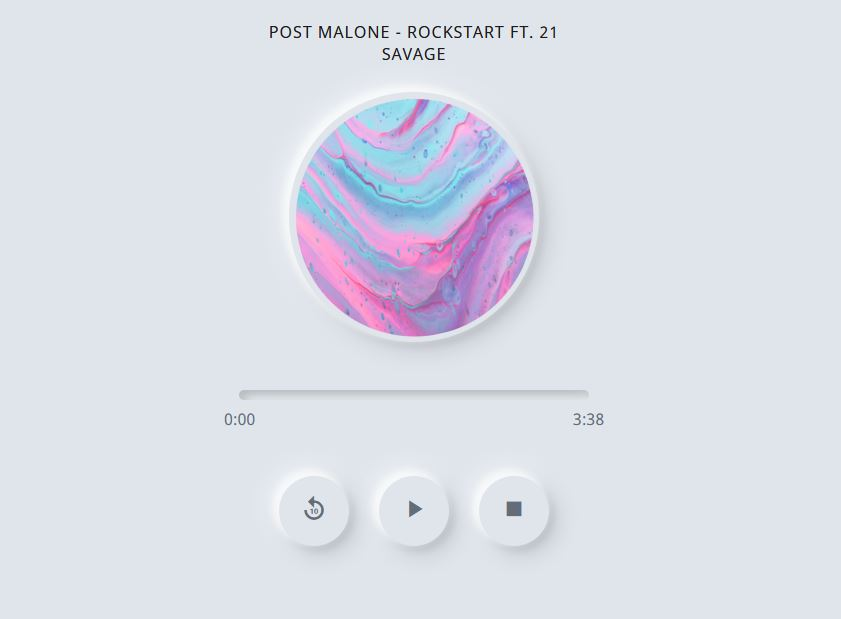

# Music Player
It's a basic music player using HTML, SASS and JS with a neumorphism design.

# Screenshot

# Neumorphism
Neumorphism, or soft UI, is a visual 
style that combines background colors, 
shapes, gradients, highlights, and 
shadows to ensure graphic intense 
buttons and switches. All that allows 
achieving a soft, extruded plastic look, 
and almost 3D styling.

# Live demo
https://codepen.io/jeremyaza/full/bGpGpXW
